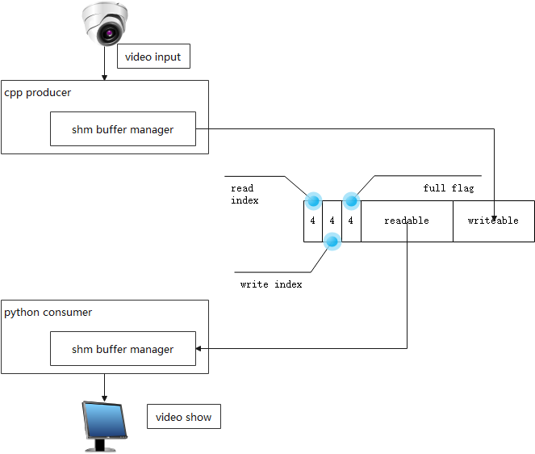

+ works fine in linux platform.
+ cpp-app read 1080p video stream，write image data to the shared memory.
+ python3.8+-app read image data from the shared memory and show video image.
+ cpp-app use boost-ipc and opencv, python-app need 3.8+ version, and pip install opencv-python.

